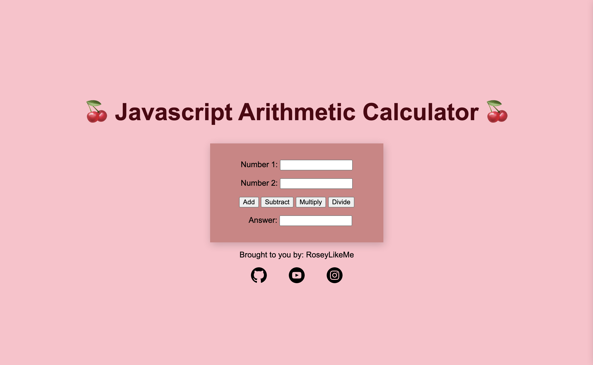

# Simple Arithmetics Calculator

Simple web arithmetic calculator that allows user to add, subtract, multiply, and divide two given numbers.

Check it out: https://roseylikeme.github.io/arithmetic-calculator/

  

